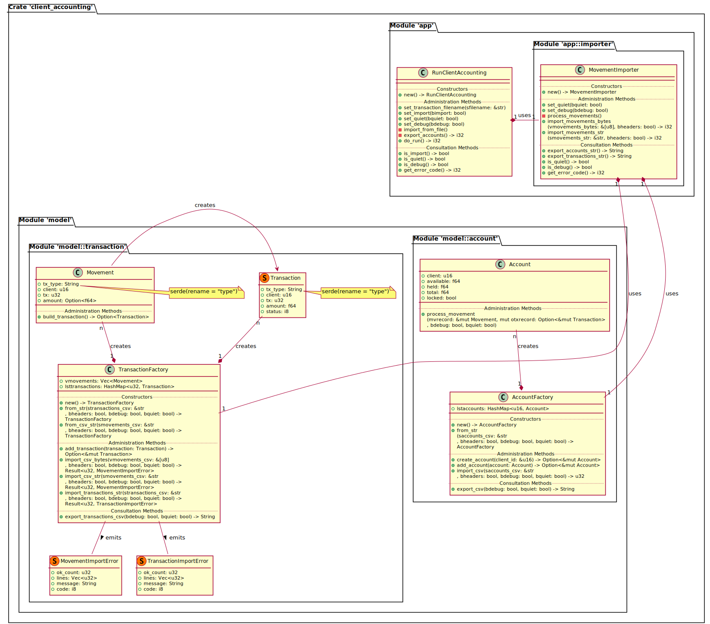

[](https://github.com/bodo-hugo-barwich/client-accounting-rs/actions/workflows/testing.yml)

# Name

Client-Accounting

## Description

This is a _Rust_ Development Exercise to process Account Movement input to calculate
the current state of Client Accounts.

## Execution

    $ cargo run -- <transaction_feed>.csv > <accounts_feed>.csv

## Application Design

The [_Factory Design_](https://en.wikipedia.org/wiki/Factory_method_pattern) which
was used to create structures that convert `CSV` text into `Account`, `Movement` or `Transaction`
objects was a powerful tool to improve maintainability and testability of the application.\
To verify the correct state of the objects the `CSV` text had to be converted back and forth
into the corresponding objects. This enables also the serializability of the internal state of
the **Accounts** and **Transaction History** which is important for the **Data Consistency**
as described under [**Persistency**](#persistency) below.\
The [**Crate Class Diagram**](docs/client-accounting_class-diagram.svg) looks like this:


## Known Limitations

### Persistency

* The **Accounts** are stateful and depend tightly on the chronology of the Transaction History
as seen in the test `dispute_fails_tests::chargeback_insufficient_funds`
```
---- dispute_fails_tests::chargeback_insufficient_funds stdout ----
Movements CSV Import Count: '4'
accs fct dmp 1:
AccountFactory { lstaccounts: {} }
txs fct dmp 1:
TransactionFactory { vmovements: [Movement { tx_type: "deposit", client: 11, tx: 9, amount: Some(1.1) }, Movement { tx_type: "withdrawal", client: 11, tx: 3, amount: Some(0.5) }, Movement { tx_type: "dispute", client: 11, tx: 9, amount: None }, Movement { tx_type: "chargeback", client: 11, tx: 9, amount: None }], lsttransactions: {3: Transaction { tx_type: "withdrawal", client: 11, tx: 3, amount: 0.5, status: 0 }, 9: Transaction { tx_type: "deposit", client: 11, tx: 9, amount: 1.1, status: 0 }} }
Movement Processing 'deposit': + '1.1 / 0'
Movement Processing 'deposit': funds '1.1 / 1.1'
Movement Processing 'withdrawal': - '0.5 / 1.1'
Movement Processing 'withdrawal': funds '0.6 / 0.6'
Movement Processing Error: Amount '-1.1 / 0.6' is not available.
txs fct dmp 2:
TransactionFactory { vmovements: [], lsttransactions: {3: Transaction { tx_type: "withdrawal", client: 11, tx: 3, amount: 0.5, status: 1 }, 9: Transaction { tx_type: "deposit", client: 11, tx: 9, amount: 1.1, status: -2 }} }
accs fct dmp 2:
AccountFactory { lstaccounts: {11: Account { client: 11, available: -0.5, held: 1.1, total: 0.6, locked: false }} }
client,available,held,total,locked
11,-0.5,1.1,0.6,false

type,client,tx,amount,status
withdrawal,11,3,0.5,1
deposit,11,9,1.1,-2

Transactions CSV Import Count: '2'
```
The _Dispute_ the _Deposit_ of `1.1` after the _Withdrawal_ of `0.5` produces a negative availability
and in consequence the a possible _Chargeback_ request cannot be satisfied. This is because the
_Dispute_ arrived **after** the _Withdrawal_. If the _Dispute_ arrived before the _Withdrawal_
then the _Withdrawal_ Transaction would have failed but a _Chargeback_ request would have been possible.\
See more details on this changed procedure at: [Place _Deposit_ Transaction Funds on "held"](https://github.com/bodo-hugo-barwich/client-accounting-rs/issues/1)

* The **Transaction History** per Account is also stateful. They will rendered invalid according
to the chronological order that they arrive and the persistent state of the
Client Account. So, the loss of Client Account Data can produce Account Movement failures.
As described above Transactions fail according to the State of the Account and the chronological order
that they arrive.

### Multithreading

* A **massive amount** of Transactions to process like perhaps millions of them can make
simultaneous processing a necessity. But the exclusive **Acount Lock** will limit the amount of Transactions that can be processed per second. This will then require a **horizontal scaling** of Client Accounting Processing nodes.
as documented at [Micro Service Architeture](https://github.com/bodo-hugo-barwich/client-accounting-rs/issues/2)
* To conserve **Account Integrity** the Transactions need to be processed in a FIFO manner per Account.
To avoid **Data Races** the Accounts need to be exclusively owned per thread that means
that they need to be locked globally. \
The **Apache Kafka** Messaging Service can provide the global synchronization of the **Transaction History**
where dedicated threads can pick messages according to their assigned Account.
